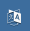

# DLE German / Deutsches Sprachpaket für DLE

## Beschreibung

Ich habe bereits für einige meine Kunden die CMS DLE installiert gehabt, die eben die deutsche Sprache der Webseite genutzt haben. Meine Version der Übersetzung bezieht sich auf meiner eigenen per-Hand Übersetzung, sowie mit der Unterstützung der KI-Werkzeuge.

## Installation

1. Dateien aus dem Verzeichnis <kbd>upload</kbd> in den Quellordner (dort, wo sich die <kbd>index.php</kbd> befindet) hochladen.
2. Sprache ändern
	1. Als Standard setzen
		1. Über die Weboberfläche
			- In den Einstellungen die Deutsche Sprache auswählen (Im Seitenmenü <kbd>Настройки скрипта</kbd> auswählen)
			-  Auf <kbd>Настройка системы</kbd> klicken
			-  <kbd>Используемый язык</kbd> suchen
			-  Sprache im Auswahlmenü wählen
			-  Auf <kbd>Сохранить</kbd> unten auf der Webseite klicken
		1. Über die **config.php**
			- Datei `/engine/data/config.php` aufmachen
			- Nach `'langs' => 'Russian'`suchen
			- <kbd>Russian</kbd> mit <kbd>German</kbd> ersetzen
			- Die Datei speichern
	2. Sprache setzen
		- Im oberen Menü den "Übersetzungsicon"  auswählen und anklicken
		- Deutsche Sprache auswählen
3. Template anpassen
	1. <kbd>Systemeinstellungen</kbd> aufmachen
	2. Nach <kbd>Standard-Webseitendesign</kbd> suchen
	3. Eins der drei Designs auswählen
	4. <kbd>Speichern</kbd> klicken

